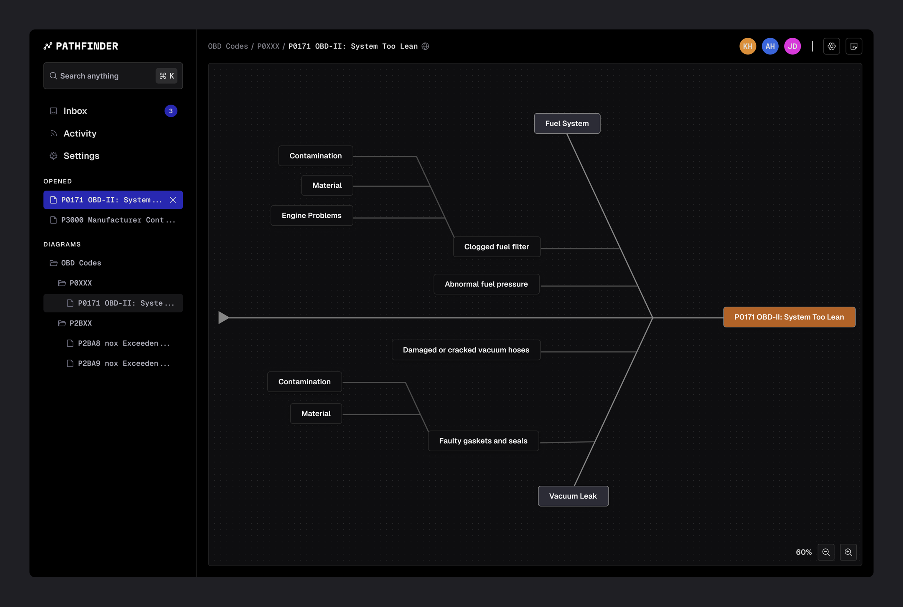

# Pathfinder

An interactive diagram tool for creating and editing fishbone diagrams.

# Demo

[Click here to watch the full video demo](https://drive.google.com/file/d/17SxRWm6lFZu2zwgF_OOJM5Yve5x7c0b5/view?usp=sharing)

# Getting Started

1. Clone or download the repo and `cd` into the root project folder
2. Open the `.npmrc` file and replace `PUBLIC_TOKEN` with the token provided to you.
3. Run `git init`
4. Run `npm install`
5. When the installation completes, `cd` into the `./node_modules/sqlite3` folder and run `npx node-gyp rebuild`.
6. After that is done, `cd` back into the root project folder (`cd ../../`)
7. Run `npm run dev`

# How to use

- Double click a node to edit
- Left click a node and press the `Delete` or `Backspace` key to delete
- Click the `plus` button next to a focused node to add

# Notes

- This is built with Canvex, my own canvas library built entirely from scratch with zero dependencies.
- The yellow number on the top left is the frame rate and is just for debugging purposes.
- Because of the context of the project, I decided to implement the backend using SQLite for its portability and implement API calls using the Solid Start metaframework.
- The diagram scales infinitely.
- The diagram and nodes are customizable allowing developers to customize things like backgrounds, borders, and even fonts.
