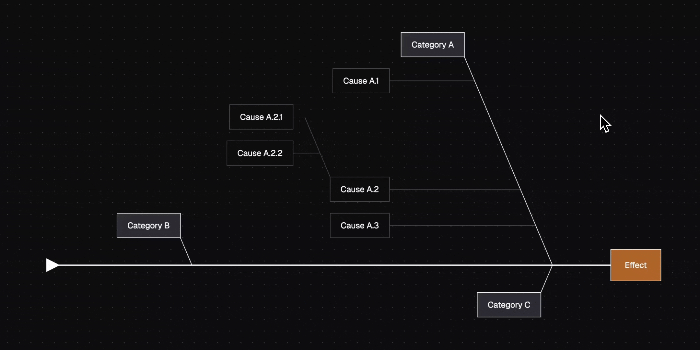
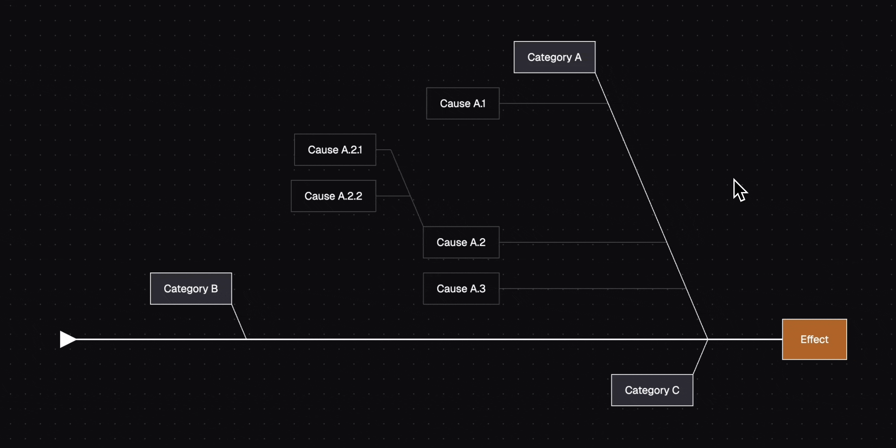
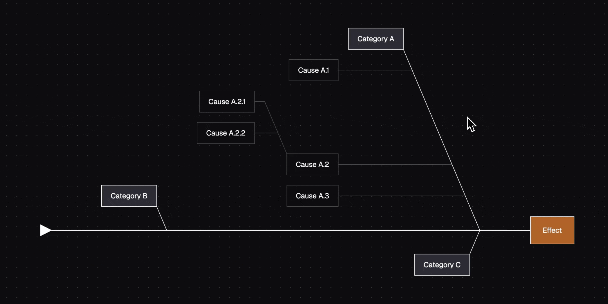
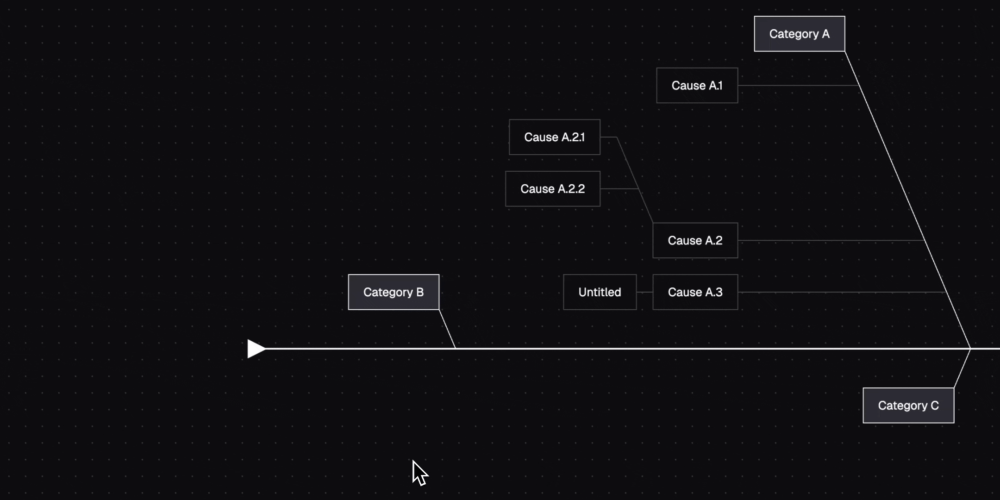
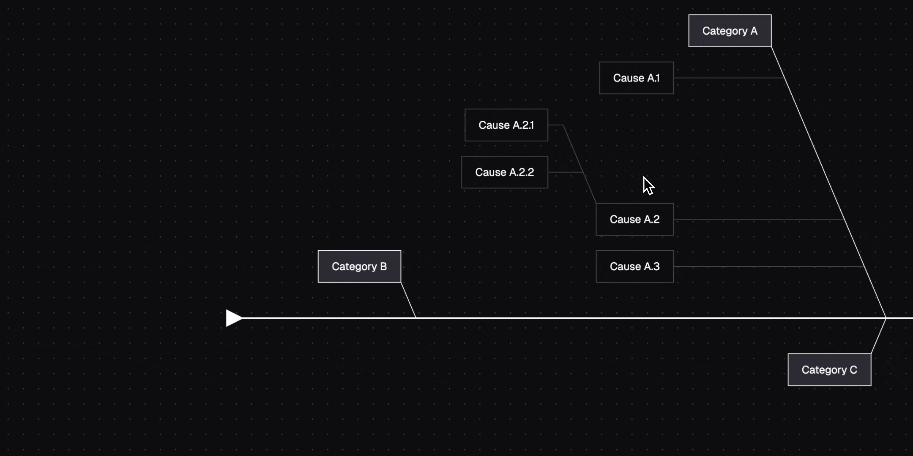
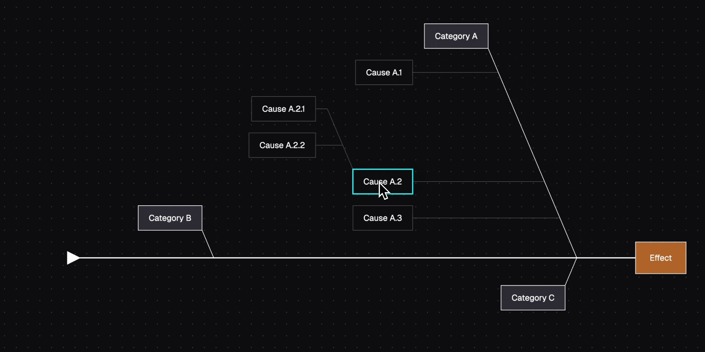

# Pathfinder

An interactive diagramming tool for creating and editing fishbone diagrams.

# 🎥 Demo

[Click here to watch the full video demo](https://drive.google.com/file/d/17SxRWm6lFZu2zwgF_OOJM5Yve5x7c0b5/view?usp=sharing)

# 🚀 Getting Started

1. Clone or download the repo and `cd` into the root project folder
2. Open the `.npmrc` file and replace `PUBLIC_TOKEN` with the token provided to you.
3. Run `git init`
4. Run `npm install`
5. When the installation completes, `cd` into the `./node_modules/sqlite3` folder and run `npx node-gyp rebuild`.
6. After that is done, `cd` back into the root project folder (`cd ../../`)
7. Run `npm run dev`

# 📚 Usage

> [!NOTE]
> Only **5 hours** was allotted for this project from conception, to design, to implementation. Notes are included to highlight just _some_ of the many ways to improve the UX if time permitted.

## Selecting a node

Selcting a node is simple: just hover over the target node and left click. To deselect, simply click on an empty area on the canvas.

## Adding a new node

You can add an infinite number of nodes on the diagram. When a node is selected, a blue "Add Button" with a plus sign will appear. Clicking on the button will immediately add a new nested node.

> [!NOTE]
> The instant centering of the newly added node should be improved with a smooth scrolling effect. This helps avoid disrupting the user's flow and thought process due to the sudden visual change. Additionally, a keyboard shortcut (i.e. hold down `Control` and left clicking) could be implemented in scenarios where the user does not want to immediately select the new node after it has been added.

## Editing a node

To edit a node, first select the node and double-click it. A prompt will appear with the new desired text. If an empty text is entered, the node will be deleted.

> [!NOTE]
> Having a prompt is very unintuitive and blocks any other action from the user. Ideally, a right sidebar would be implemented to display the node's metadata and allow actions such as editing and deleting.

## Deleting a node

You can delete a node by first selecting it and pressing either `Delete` or `Backspace` on your keyboard. This will delete any nested nodes.

> [!NOTE]
> This would be much more intuitive if time permitted a right sidebar to be implemented. On top of that, a context menu could be added when right clicking to give the user actions to add, edit, or delete. This would help provide a better UX for users that are less keyboard-focused. For some use cases, the user may opt to delete a node without removing the nested nodes. Further consideration of the user's needs is required to implement that.

## Panning around the canvas

By clicking and holding the left or middle mouse button and moving the mouse, you can pan around the canvas to navigate to different nodes.

> [!NOTE]
> Initially, only the middle mouse button would activate panning. From the feedback received, the functionality to include the left mouse button was quickly included. In the future, a dedicated toolbar could be implemented which will have access to a "Hand" tool. Because the canvas can be infinitely large, a button to center the view to the diagram should be added.

## Zooming in and out

Pinch in and out on your touchpad to zoom in. If using a mouse, you can hold down the `Control` or `Command` key and scroll with the mouse wheel to zoom in and out.

> [!NOTE]
> A dedicated tool (i.e. a magnifying glass) and dedicated keyboard shortcuts for zooming would be helpful for accessibility.

# 🗒️ Notes

- This is built with Canvex, my own canvas library built entirely from scratch with zero dependencies. This was used purely for rendering purposes only. The fishbone aspect was developed during the sprint.
- The yellow number on the top left of the demo is the frame rate and is for debugging purposes to highlight the rendering performance.
- Given more time, many improvements to the codebase would have been implemented to fix known bugs and ensure best practices.
- Because of the context of the project, I decided to implement the backend using SQLite for its portability and implement API calls using the Solid Start meta-framework.
- The diagram can scale infinitely and supports an unlimited amount of nesting.
- Nodes are customizable allowing developers to customize the background, border, and font. This could be further improved to allow custom shapes.
